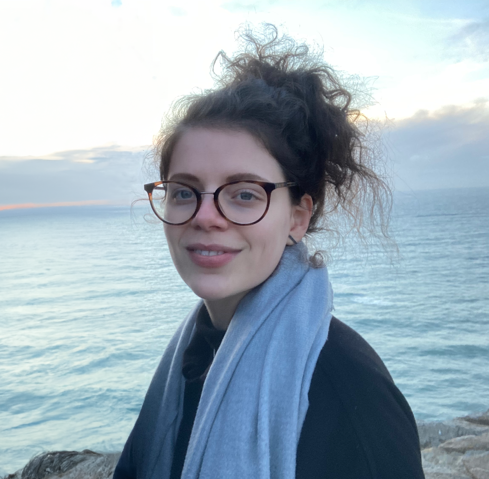

---
#
# By default, content added below the "---" mark will appear in the home page
# between the top bar and the list of recent posts.
# To change the home page layout, edit the _layouts/home.html file.
# See: https://jekyllrb.com/docs/themes/#overriding-theme-defaults
#
layout: page
---

I'm a second-year doctoral student at the Division of [Robotics, Perception and Learning (RPL)](https://www.kth.se/is/rpl/division-of-robotics-perception-and-learning-1.779439) under the supervision of [Professor Danica Kragic](https://www.csc.kth.se/~danik/).

My research lies at the intersection between robotics and machine learning. In particular, I focus on robotic perception and manipulation of deformable objects. Currently, I'm interested in learning world models from robotic interaction and sensing, which requires to encode complex physics behaviors into latent represenations.

---

### Reviews

  * Reviewer for IROS 2022
  * Reviewer for ICRA 2022-2023 
  * Reviewer for ICRA 2022 workshop on [Representing and Manipulating Deformable Objects](https://deformable-workshop.github.io/icra2022/)

---

### Contact


**Calendar**: [Free/busy Calendar](https://calendar.google.com/calendar/embed?src=zerickso%40andrew.cmu.edu&ctz=America%2FNew_York&mode=WEEK)  
Please check my calendar to see if I am available prior to suggesting a meeting time.


**Email**: albertal@kth.se

**Office**: Teknikringen 14, Room 712.

**Address**  
KTH Royal Institute of Technology  
Division of Robotics, Perception, and Learning (RPL)  
School of Electrical Engineering and Computer Science  
Teknikringen 14, 7th floor, SE-100 44 Stockholm, Sweden  

---

### Teaching Assistant

Fall 2022: [Image Analysis and Computer Vision (DD2423)](https://www.kth.se/social/course/DD2423/)  
Fall 2022: [Introduction to Robotics (DD2410)](https://www.kth.se/social/course/DD2410/)


---
### Extra links
You can find a recording of my Robotics PhD Defense at Georgia Tech here: [https://youtu.be/3DYv8SlaP2w](https://youtu.be/3DYv8SlaP2w)

In 2016, I participated in the 4th Heidelberg Laureate Forum. Here are [some photos from the 4th HLF](https://zackory.com/hlf4/).

